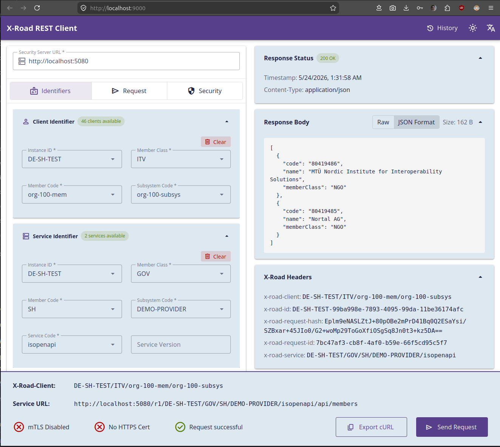
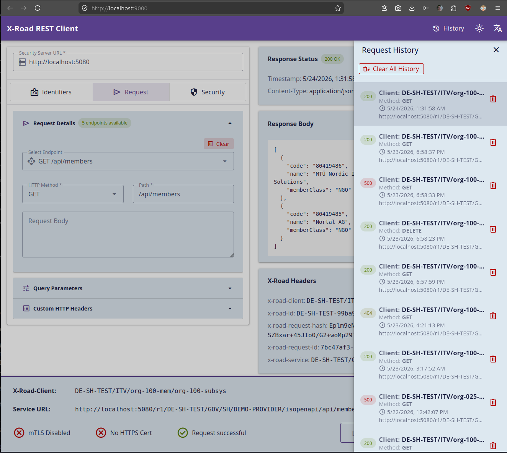
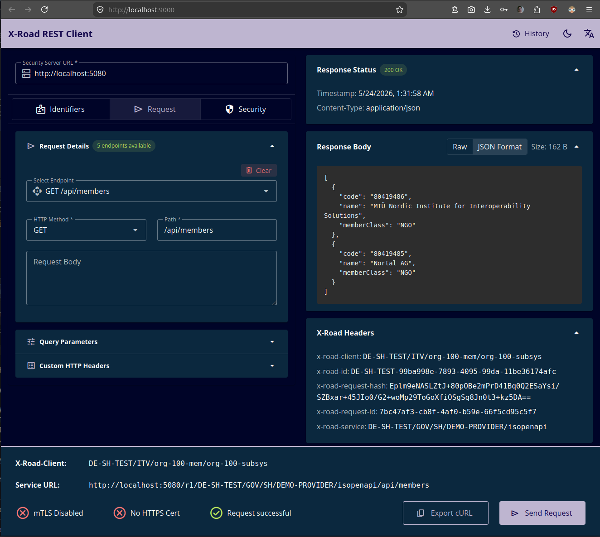

# X-Road Generic REST Client

A web-based tool for testing X-Road REST services. Configure client/service identifiers, send requests, and view responses with formatted JSON and syntax highlighting.

## Quick Start

**Docker:**
```bash
docker run -p 8080:8080 ghcr.io/melbeltagy/x-road-example-restapi-client:latest
```

**From source:**
```bash
./gradlew
```

Open http://localhost:8080

## Docker

See [docker/README.md](docker/README.md) for full Docker documentation including:
- Docker Compose setup
- Connecting to a local Security Server
- Configuration options
- Building locally
- Available tags

## Development

### Requirements

- Java 25
- Node.js 22+ and pnpm 10+

### Running locally (with hot reload)

```bash
# Backend
./gradlew -x webapp

# Frontend (separate terminal)
cd src/main/webapp && pnpm dev
```

Open http://localhost:9000 (note: frontend runs on port 9000 in hot reload mode)

### Production build

```bash
./gradlew -Pprod clean bootJar
java -jar build/libs/*.jar
```

## Configuration

Edit `src/main/resources/application.yml`:

```yaml
application:
  xroad:
    timeout:
      connect-ms: 60000
      read-ms: 120000
  frontend:
    max-history-entries: 15
```

For Docker configuration, see [docker/README.md](docker/README.md#configuration).

## Testing

### Backend Tests

```bash
# Run unit tests
./gradlew test

# Run integration tests
./gradlew integrationTest

# Run all tests with coverage report
./gradlew test jacocoTestReport

# Run tests with coverage verification (fails if coverage < 80%)
./gradlew check
```

**Coverage reports:** `build/reports/jacoco/test/html/index.html`

### Frontend Tests

```bash
cd src/main/webapp

# Run tests in watch mode
pnpm test

# Run tests once
pnpm test:run

# Run tests with coverage report
pnpm test:coverage
```

**Coverage reports:** `src/main/webapp/coverage/index.html`

### Code Quality

```bash
# Backend: Checkstyle
./gradlew checkstyleMain -x webapp

# Frontend: ESLint
cd src/main/webapp && pnpm lint

# Frontend: TypeScript check
cd src/main/webapp && pnpm type-check
```

## Screenshots

**Client and service identifiers with auto-complete dropdowns**



**Request configuration, response viewer, and request history**



**Dark theme**


